# 🌍 MCP Travel Multi-Agent System

A revolutionary AI-powered travel planning system featuring **multi-agent coordination**, **interactive maps**, **personality-driven recommendations**, and **climate-smart planning**. This advanced system uses specialized AI agents, MCP servers, and real-time data to create the most comprehensive and personalized travel experiences possible.

## 🎯 **See It In Action**

### 📋 **[🚀 Complete Live Demo - NYC to Tokyo 2025](./COMPLETE_DEMO.md)**
> **Experience the full system workflow!** Follow Sarah's complete journey from New York to Tokyo, showcasing all 15+ features in a real-world scenario. See how personality analysis, multi-agent coordination, voice commands, and smart analytics work together to create the perfect trip in just 3 minutes.

**🎌 What you'll see:**
- **🎭 Personality Quiz** → Culture Explorer identification
- **🤖 5 AI Agents** → Working in parallel coordination  
- **🗺️ Interactive Maps** → 73 POIs with real booking links
- **✈️ Flight Intelligence** → Multi-platform search & recommendations
- **💰 Budget Optimizer** → Smart allocation & 2.6% savings
- **🤖 Voice Assistant** → Natural language interactions
- **💬 Chat Refinement** → Real-time itinerary modifications
- **📊 Analytics** → Complete insights dashboard
- **🌤️ Weather Integration** → Climate-smart packing suggestions
- **📥 Export Options** → PDF reports & calendar sync

---

## ✨ Revolutionary Features

### 🎭 **Travel Personality AI**
- **Smart Personality Quiz**: 5-question assessment to determine your travel style
- **5 Personality Types**: Adventure Seeker, Chill Traveler, Culture Explorer, Luxury Traveler, Smart Traveler
- **Personalized Recommendations**: Itineraries automatically adapted to your personality
- **Visual Analytics**: Interactive charts showing your travel personality profile

### 🤖 **Multi-Agent Coordination System**
- **🎭 Cultural Expert**: Local customs, traditions, festivals, and etiquette guidelines
- **💰 Financial Advisor**: Currency exchange, money-saving tips, and budget optimization
- **🍽️ Culinary Expert**: Local cuisine, dietary restrictions, and restaurant recommendations
- **📸 Experience Curator**: Unique experiences, photography spots, and Instagram-worthy locations
- **🚗 Transport Expert**: Public transportation, mobility options, and route optimization
- **Parallel Processing**: All agents work simultaneously for comprehensive insights

### 🗺️ **Enhanced Interactive Map System**
- **OpenStreetMap Integration**: Advanced POI extraction using Overpass API for comprehensive location data
- **Multiple Map Layers**: OpenStreetMap, CartoDB (Light/Dark), OpenTopoMap (Terrain), Esri Satellite
- **Real POI Discovery**: Extracts restaurants, hotels, attractions, shops from OpenStreetMap database
- **Dynamic Service Links**: Real booking links for Airbnb, Booking.com, Hotels.com, Expedia
- **Restaurant Integration**: Direct links to Google Maps, TripAdvisor, Yelp, Foursquare
- **Attraction Booking**: GetYourGuide and Viator integration for activities
- **Advanced Map Controls**: Layer switching, measurement tools, fullscreen, mini-map, search
- **Smart Categorization**: Automatic POI classification with detailed subcategories
- **Interactive Popups**: Rich information with real booking and review links

### 💰 **AI Budget Optimizer**
- **Personality-Based Allocation**: Budget distribution adapted to your travel style
- **Priority Sliders**: Customize spending on accommodation, food, activities
- **Smart Reallocation**: Dynamic budget adjustment based on preferences
- **Visual Breakdown**: Interactive pie charts and detailed cost analysis
- **Savings Opportunities**: AI-powered suggestions for cost reduction

### 🌍 **Climate-Smart Planning**
- **🏠 Origin City Integration**: Input your exact departure city for personalized calculations
- **📏 Real Distance Calculation**: Uses Nominatim geocoding + geodesic algorithms for precise flight distances
- **🌍 Geolocation Intelligence**: Converts city names to exact coordinates for accurate measurements
- **♻️ Personalized Carbon Footprint**: Sustainability scores based on YOUR actual location
- **📊 Real-Time Metrics**: Visual display of calculated flight distance from your city
- **🔄 Smart Fallback System**: Regional estimates if geocoding fails
- **🚌 Transportation Impact Assessment**: Analyzes transport mentions in itinerary for eco-friendliness
- **🏨 Accommodation Sustainability Rating**: Evaluates lodging choices for environmental impact
- **🎯 Activity Environmental Scoring**: Rates activities based on sustainability factors
- **🌤️ Weather Integration**: Real-time climate conditions and forecasts
- **⚠️ Climate Risk Assessment**: Weather-related warnings and preparations

### 🏠 **Personalized Origin System**
- **🌍 Your Location Matters**: Input your exact departure city for 100% personalized planning
- **📏 Real Distance Calculation**: 
  - Uses **Nominatim** geocoding to find exact coordinates
  - **Geodesic algorithms** calculate precise flight distances considering Earth's curvature
  - **Real Examples**: São Paulo → Paris = 9,194km | New York → Tokyo = 10,838km
- **♻️ Accurate Carbon Footprint**: Sustainability scores based on YOUR actual travel distance
- **📊 Visual Distance Metrics**: See exact kilometers from your city to destination
- **🔄 Intelligent Fallback**: Regional estimates if specific city isn't found
- **✅ Mandatory Validation**: System requires origin city for accurate planning

### ✈️ **Flight Search & Price Intelligence**
- **Multi-Platform Search**: Real-time flight comparison across Kayak, Skyscanner, Google Flights, Momondo, Expedia
- **Flexible Date Finder**: Discover cheapest travel dates within any month
- **Smart Seat Recommendations**: AI-powered seat selection based on preferences and flight duration
- **Layover Activity Suggestions**: Curated activities for connection times at major airports
- **Price Trend Analysis**: Historical pricing data and booking recommendations
- **Direct Booking Integration**: Seamless links to airline and travel platform booking systems

### 🚗 **Transportation Intelligence Hub**
- **Real-Time Rideshare Pricing**: Live estimates for Uber, Lyft, 99, Cabify with time and distance
- **Car Rental Comparison**: Comprehensive comparison across Hertz, Avis, Budget, Localiza
- **Public Transport Integration**: Local metro, bus, train, and bike-sharing information
- **Multi-Modal Route Planning**: Optimal transportation combinations for any journey
- **Cost-Benefit Analysis**: Compare all transport options with time and price factors

### 🎭 **Events & Entertainment Discovery**
- **Local Event Mining**: Real-time discovery through Eventbrite, Meetup, Facebook Events
- **Cultural Calendar Integration**: Festivals, exhibitions, concerts, and local celebrations
- **Category-Based Filtering**: Art & Culture, Music, Food & Drink, Sports, Nightlife, Family
- **Ticket Booking Integration**: Direct links to event ticketing platforms
- **Personalized Recommendations**: Events matched to your travel personality and interests

### 💱 **Financial Intelligence Center**
- **Real-Time Exchange Rates**: Live currency conversion for USD, BRL, EUR, GBP, JPY and more
- **Smart Currency Converter**: Instant conversion with historical rate context
- **Best Exchange Locations**: Curated list of banks, exchange houses, and ATMs with rates
- **Travel Money Optimization**: Recommendations for when and where to exchange currency
- **Budget Impact Analysis**: Real-time cost calculations in your home currency

### 🤖 **AI Voice Travel Companion**
- **Natural Language Processing**: Voice commands in multiple languages (English, Portuguese, Spanish, French)
- **Hands-Free Operation**: Complete voice control for flight searches, weather, hotels, restaurants
- **Intelligent Conversation**: Context-aware responses with conversation memory
- **Voice Customization**: Adjustable speech speed and language preferences
- **Multi-Modal Interaction**: Seamless switching between voice and text interfaces

### 🤖 **Conversational Itinerary Refinement**
- **Real-Time Chat Interface**: Modify your itinerary through natural conversation
- **Persistent Chat History**: All refinement requests saved and tracked
- **Intelligent Modifications**: AI understands context and maintains trip coherence
- **Instant Updates**: Changes reflected immediately in your itinerary

### 📊 **Advanced Analytics Dashboard**
- **Budget Visualization**: Interactive pie charts and spending breakdowns
- **Personality Insights**: Bar charts showing your travel trait distribution
- **Sustainability Metrics**: Environmental impact scores and recommendations
- **Climate Analysis**: Weather patterns and packing suggestions

### 📥 **Multi-Format Export System**
- **📅 Calendar Integration**: .ics files for Google Calendar, Apple Calendar, Outlook
- **📄 Professional PDF Reports**: Beautifully formatted itineraries with tables and styling
- **💾 JSON Data Export**: Complete trip data for backup and sharing
- **🗺️ Map Integration**: Embedded maps in exported documents

### 🏨 **Enhanced MCP Integrations**
- **Airbnb Real-Time Data**: Live pricing, availability, and property details
- **Google Maps Precision**: Exact distances, travel times, and route optimization
- **Robust Fallback System**: Automatic backup when MCP connections fail
- **Extended Timeout Handling**: Reliable connections for complex queries

### 🎯 **Intelligent User Experience**
- **Tabbed Interface**: Organized content across 5 dedicated tabs
- **Responsive Design**: Works seamlessly on desktop and mobile
- **State Management**: All preferences and data preserved across sessions
- **Error Handling**: Graceful degradation when services are unavailable
- **Progress Indicators**: Real-time feedback during processing
## 🚀 Setup

### Requirements

**API Keys (Both Required):**
- **OpenAI API Key**: Get your API key from [OpenAI Platform](https://platform.openai.com/api-keys)
- **Google Maps API Key**: Get your API key from [Google Cloud Console](https://console.cloud.google.com/apis/credentials)
- **Python 3.8+**: Ensure you have Python 3.8 or higher installed

**Enhanced Dependencies**: The system now includes:
- **Interactive Mapping**: Folium + Streamlit-Folium for professional maps with OpenStreetMap integration
- **Advanced POI Discovery**: Overpy for OpenStreetMap Overpass API integration
- **Voice Intelligence**: SpeechRecognition + pyttsx3 for natural voice interaction
- **Financial Data**: yfinance for real-time currency and financial information
- **Web Intelligence**: BeautifulSoup4 for advanced web scraping capabilities
- **Data Visualization**: Plotly for interactive charts and analytics
- **PDF Generation**: ReportLab for beautiful PDF reports
- **Data Processing**: Pandas + NumPy for advanced analytics
- **🌍 Real Geolocation**: Geopy with Nominatim + Geodesic for precise distance calculations ⭐
- **🏠 Origin Intelligence**: Calculate exact flight distances from YOUR city to any destination

**MCP Servers**: The app automatically connects to:
- **Airbnb MCP Server**: Provides real Airbnb listings and pricing data
- **Google Maps MCP**: Enables precise distance calculations and location services
- **Enhanced Fallback System**: Robust error handling and connection management

### Installation

1. Clone this repository:
```bash
git clone https://github.com/gregorizeidler/mcp-travel-multi-agent-system.git
cd mcp-travel-multi-agent-system
```

2. Install the required Python packages:
```bash
pip install -r requirements.txt
```

### Running the App

1. Start the Streamlit app:
```bash
streamlit run app.py
```

2. In the app interface:

**🎭 Step 1: Discover Your Travel Personality**
   - Click "📝 Take Personality Quiz" in the sidebar
   - Answer 5 questions about your travel preferences
   - Get your personalized travel type and visual profile

**🔑 Step 2: Configure API Keys**
   - Enter your OpenAI API key in the sidebar
   - Enter your Google Maps API key in the sidebar
   - See confirmation when both keys are configured

**🌍 Step 3: Plan Your Trip**
   - **🏠 Enter Your Origin City**: Specify where you're traveling from (e.g., "São Paulo", "London") ⭐
   - **🎯 Specify Destination**: Where you want to travel
   - Set duration, budget, and start date
   - Describe your preferences or select quick options
   - Adjust budget priorities with the optimizer sliders
   - Enable climate-smart planning for **personalized sustainability scores** ⭐

**🎯 Step 4: Generate & Explore**
   - Click "🎯 Generate Itinerary" for your AI-powered plan
   - Explore your results across 5 interactive tabs:
     - **📋 Itinerary**: Your complete travel plan
     - **🗺️ Interactive Map**: Visual location mapping
     - **🤖 Refine Chat**: Conversational modifications
     - **📊 Analytics**: Budget and personality insights
     - **📥 Export**: Multiple download formats

**💬 Step 5: Refine & Perfect**
   - Use the chat interface to modify your itinerary
   - Ask for changes like "Add more cultural activities" or "Reduce accommodation budget"
   - See real-time updates to your travel plan

**📥 Step 6: Export & Use**
   - Download as calendar (.ics) for your calendar app
   - Generate professional PDF reports
   - Export JSON data for backup or sharing

## 🌍 Real Distance Examples

The system now calculates **exact flight distances** from your city:

| Origin City | Destination | Real Distance | Sustainability Score |
|-------------|-------------|---------------|---------------------|
| São Paulo | Paris | 9,194 km | 8/100 (Long distance) |
| New York | London | 5,585 km | 44/100 (Medium distance) |
| Rio de Janeiro | Buenos Aires | 1,196 km | 88/100 (Short distance) |
| Tokyo | Seoul | 1,160 km | 88/100 (Short distance) |
| Los Angeles | Sydney | 12,051 km | 0/100 (Very long distance) |
| Madrid | Rome | 1,365 km | 86/100 (Short distance) |

**⭐ Powered by**: Nominatim geocoding + Geodesic distance algorithms for maximum accuracy!

## 🔧 Troubleshooting

### Common Issues & Solutions

**"Error: [error message]"**: Check your internet connection and API keys
- Verify both OpenAI and Google Maps API keys are entered correctly
- Try again in a few minutes - the MCP servers may be temporarily unavailable

**Missing distance information**: Google Maps MCP connection issue
- Check your Google Maps API key validity
- Ensure your API key has the necessary permissions for Maps API
- Try refreshing the page and entering the keys again

**Slow response times**: MCP servers can take time to respond
- The app has a 60-second timeout configured
- Wait for the process to complete - detailed itineraries take time to generate

**Network/Firewall issues**: Some corporate networks may block MCP connections
- Try from a different network
- Use a VPN if necessary
- The app will show connection errors if MCP servers are unreachable

### API Key Issues
- **OpenAI API Key**: Make sure you have credits in your OpenAI account and the key is valid
- **Google Maps API Key**: Ensure the key has Maps API enabled and proper billing setup

### Tool Status
The app will show you which data sources were successfully used:
- 🏨 **"Your travel itinerary is ready with Airbnb data!"** = Airbnb MCP connected successfully
- 📝 **"Used general knowledge for accommodation suggestions"** = Airbnb MCP failed, using general knowledge as fallback

> **Note**: The app is designed to work reliably! Even if MCP connections fail, it will generate comprehensive itineraries using available tools and information.

## 📁 Project Structure

```
├── app.py              # Main Streamlit application with MCP integration
├── requirements.txt    # Python dependencies
└── README.md          # This documentation
```

## 🎯 **What Makes This System Revolutionary**

### 🚀 **Advanced AI Architecture**
- **5 Specialized AI Agents** working in parallel coordination
- **Real-time data integration** from multiple MCP servers
- **Personality-driven customization** for truly personalized experiences
- **Climate-smart recommendations** for sustainable travel

### 🎭 **Personality-Driven Intelligence**
The system analyzes your travel personality through a scientifically-designed quiz and adapts every recommendation:
- **Adventure Seekers** get thrilling activities and flexible schedules
- **Culture Explorers** receive deep local insights and authentic experiences  
- **Luxury Travelers** enjoy premium accommodations and fine dining
- **Budget Travelers** maximize value with smart cost optimizations
- **Chill Travelers** get relaxed pacing and wellness-focused activities

### 💡 **Smart Budget Optimization**
- **Dynamic allocation** based on your personality and priorities
- **Real-time cost analysis** with savings opportunities
- **Visual budget tracking** with interactive charts
- **Intelligent rebalancing** when you adjust preferences

### 🌍 **Climate-Smart Technology**
- **🏠 Personalized Origin System**: Real distance calculations from YOUR city ⭐
- **📏 Geodesic Precision**: Exact flight distances using Earth's curvature calculations ⭐
- **♻️ Accurate Carbon Footprint**: Sustainability scores based on real travel distances ⭐
- **🌤️ Weather-integrated planning** with real-time forecasts
- **🌱 Eco-friendly alternatives** for conscious travelers
- **📊 Visual Distance Metrics**: See exact kilometers from your location ⭐

### 🗺️ **Interactive Visual Experience**
- **Professional mapping** with color-coded locations
- **Real-time geocoding** for accurate positioning
- **Route optimization** with distance calculations
- **Visual itinerary exploration** through interactive maps

### 🤖 **Conversational Refinement**
- **Natural language modifications** through chat interface
- **Context-aware adjustments** that maintain trip coherence
- **Instant updates** reflected across all system components
- **Persistent conversation history** for iterative improvements

## 🧠 How It Works

The **MCP Travel Multi-Agent System** uses a sophisticated multi-step process to create extremely detailed travel itineraries:

### 🎯 System Architecture Flow

```mermaid
graph TB
    A[🏠 Origin City Input] --> B[🎯 Destination Input]
    B --> C[🤖 AI Travel Agent]
    C --> D{🔗 MCP Connections}
    
    D --> E[🏨 Airbnb MCP Server]
    D --> F[🗺️ Google Maps MCP]
    D --> G[🔍 Google Search API]
    
    A --> H[📏 Geolocation Service]
    B --> H
    H --> I[📊 Real Distance Calculation]
    
    E --> J[🏠 Real Accommodation Data]
    F --> K[📍 Location & Route Data]
    G --> L[🌤️ Weather & Local Info]
    I --> M[♻️ Sustainability Scoring]
    
    J --> N[🧠 GPT-4o Processing]
    K --> N
    L --> N
    M --> N
    
    N --> O[📋 Personalized Itinerary]
    O --> P[📅 Calendar Export]
    O --> Q[💰 Cost Breakdown]
    O --> R[🗺️ Interactive Map]
    
    style A fill:#ff9800,stroke:#e65100,stroke-width:3px,color:#000
    style B fill:#e1f5fe,stroke:#01579b,stroke-width:3px,color:#000
    style C fill:#f3e5f5,stroke:#4a148c,stroke-width:3px,color:#000
    style H fill:#4caf50,stroke:#2e7d32,stroke-width:3px,color:#000
    style I fill:#81c784,stroke:#388e3c,stroke-width:3px,color:#000
    style M fill:#66bb6a,stroke:#43a047,stroke-width:3px,color:#000
    style N fill:#f1f8e9,stroke:#33691e,stroke-width:3px,color:#000
    style O fill:#e3f2fd,stroke:#0d47a1,stroke-width:3px,color:#000
```



### 🔄 Multi-Agent Workflow

```mermaid
flowchart LR
    subgraph "🎯 Enhanced Input Processing"
        A[🏠 Origin City] --> B[🎨 Input Validator]
        C[🎯 Destination] --> B
        D[👤 User Preferences] --> B
        E[💰 Budget Constraints] --> B
        F[📅 Travel Dates] --> B
    end
    
    subgraph "📏 Geolocation Intelligence"
        B --> G[🌍 Nominatim Geocoder]
        G --> H[📊 Geodesic Calculator]
        H --> I[♻️ Sustainability Scorer]
    end
    
    subgraph "🤖 Specialized Agent Coordination"
        B --> J[🎭 Cultural Expert Agent]
        B --> K[💰 Financial Advisor Agent]
        B --> L[🍽️ Gastronomy Expert Agent]
        B --> M[📸 Experience Curator Agent]
        B --> N[🚗 Transport Expert Agent]
    end
    
    subgraph "📊 Real-Time Data Collection"
        J --> O[🏛️ Cultural Data]
        K --> P[💵 Financial Data]
        L --> Q[🍴 Culinary Data]
        M --> R[🎯 Experience Data]
        N --> S[🚌 Transport Data]
        I --> T[🌱 Environmental Data]
    end
    
    subgraph "🧠 AI Processing & Synthesis"
        O --> U[🤖 GPT-4o Orchestrator]
        P --> U
        Q --> U
        R --> U
        S --> U
        T --> U
    end
    
    subgraph "📋 Personalized Output Generation"
        U --> V[📝 Detailed Itinerary]
        U --> W[📅 Calendar Events]
        U --> X[💰 Budget Report]
        U --> Y[🗺️ Interactive Map]
        U --> Z[📊 Sustainability Report]
    end
    
    style A fill:#ff9800,stroke:#e65100,stroke-width:3px,color:#000
    style C fill:#2196f3,stroke:#0d47a1,stroke-width:3px,color:#000
    style G fill:#4caf50,stroke:#2e7d32,stroke-width:3px,color:#000
    style H fill:#66bb6a,stroke:#388e3c,stroke-width:3px,color:#000
    style I fill:#81c784,stroke:#43a047,stroke-width:3px,color:#000
    style U fill:#f1f8e9,stroke:#33691e,stroke-width:3px,color:#000
    style V fill:#e8eaf6,stroke:#3f51b5,stroke-width:3px,color:#000
```



### 🌐 MCP Integration Flow

```mermaid
sequenceDiagram
    participant U as 👤 User
    participant S as 🖥️ Streamlit App
    participant A as 🤖 AI Agent
    participant G as 🌍 Geolocation Service
    participant AM as 🏨 Airbnb MCP
    participant GM as 🗺️ Google Maps MCP
    participant GS as 🔍 Google Search
    participant SA as 🎭 Specialized Agents
    
    U->>S: 🏠 Enter Origin City
    U->>S: 🎯 Enter Destination & Details
    S->>G: 📏 Calculate Real Distance
    G-->>S: 📊 Exact Distance + Coordinates
    S->>A: 📝 Process Enhanced Request
    
    par Parallel Multi-Agent Processing
        A->>SA: 🎭 Deploy Cultural Expert
        A->>SA: 💰 Deploy Financial Advisor
        A->>SA: 🍽️ Deploy Gastronomy Expert
        A->>SA: 📸 Deploy Experience Curator
        A->>SA: 🚗 Deploy Transport Expert
    and Parallel Data Collection
        A->>AM: 🏠 Search Accommodations
        A->>GM: 📍 Get Locations & Routes
        A->>GS: 🌤️ Research Weather & Info
    end
    
    SA-->>A: 🎯 Specialized Insights
    AM-->>A: 🏨 Real Listings Data
    GM-->>A: 🗺️ Maps & Route Data
    GS-->>A: 📊 Current Information
    
    A->>A: 🧠 Synthesize All Data
    A->>A: ♻️ Calculate Sustainability Score
    A->>S: 📋 Personalized Travel Plan
    S->>U: ✨ Display Enhanced Results
    
    opt Interactive Features
        U->>S: 🗺️ View Interactive Map
        U->>S: 🤖 Chat Refinement
        U->>S: 📊 View Analytics
        U->>S: 📥 Export (Calendar/PDF/JSON)
    end
```



### 🎨 Itinerary Generation Process

```mermaid
graph TD
    A[🏠 Origin + 🎯 Destination Input] --> B{📊 Enhanced Data Validation}
    B -->|✅ Valid| C[🌍 Geolocation Processing]
    B -->|❌ Invalid| D[⚠️ Request Clarification]
    
    C --> E[📏 Real Distance Calculation]
    E --> F[♻️ Sustainability Pre-Assessment]
    
    F --> G[🔍 Multi-Source Research]
    G --> H[🏨 Accommodation Search]
    G --> I[🗺️ Location Analysis]
    G --> J[🌤️ Weather Research]
    G --> K[💰 Budget Planning]
    
    G --> L[🎭 Cultural Expert Analysis]
    G --> M[💰 Financial Advisor Input]
    G --> N[🍽️ Gastronomy Expert Research]
    G --> O[📸 Experience Curator Suggestions]
    G --> P[🚗 Transport Expert Planning]
    
    H --> Q[📋 Enhanced Data Synthesis]
    I --> Q
    J --> Q
    K --> Q
    L --> Q
    M --> Q
    N --> Q
    O --> Q
    P --> Q
    
    Q --> R[🧠 AI Multi-Agent Orchestration]
    R --> S[📝 Personalized Day-by-Day Planning]
    S --> T[⏰ Time & Route Optimization]
    T --> U[💵 Real Cost Calculation]
    U --> V[♻️ Final Sustainability Scoring]
    
    V --> W[📋 Complete Personalized Itinerary]
    W --> X[📅 Calendar Export]
    W --> Y[💰 Budget Report]
    W --> Z[🗺️ Interactive Map]
    W --> AA[📊 Analytics Dashboard]
    
    style A fill:#ff9800,stroke:#e65100,stroke-width:3px,color:#000
    style C fill:#4caf50,stroke:#2e7d32,stroke-width:3px,color:#000
    style E fill:#66bb6a,stroke:#388e3c,stroke-width:3px,color:#000
    style F fill:#81c784,stroke:#43a047,stroke-width:3px,color:#000
    style Q fill:#f3e5f5,stroke:#7b1fa2,stroke-width:3px,color:#000
    style R fill:#fff8e1,stroke:#f9a825,stroke-width:3px,color:#000
    style W fill:#e8eaf6,stroke:#3f51b5,stroke-width:3px,color:#000
    style D fill:#ffebee,stroke:#d32f2f,stroke-width:2px,color:#000
```



### 🔧 Technical Architecture

```mermaid
graph LR
    subgraph "🖥️ Enhanced Frontend Layer"
        A[🎨 Streamlit UI]
        B[📱 Interactive Interface]
        C[📊 Advanced Visualization]
        D[🗺️ Map Integration]
        E[🤖 Chat Interface]
    end
    
    subgraph "🧠 AI Processing Layer"
        F[🤖 Main AI Agent]
        G[🎭 Cultural Expert]
        H[💰 Financial Advisor]
        I[🍽️ Gastronomy Expert]
        J[📸 Experience Curator]
        K[🚗 Transport Expert]
    end
    
    subgraph "🌍 Geolocation Layer"
        L[🏠 Origin Processor]
        M[🎯 Destination Processor]
        N[📏 Distance Calculator]
        O[♻️ Sustainability Scorer]
    end
    
    subgraph "🔗 Enhanced Integration Layer"
        P[🏨 Airbnb MCP Client]
        Q[🗺️ Google Maps MCP Client]
        R[🔍 Google Search Client]
        S[🌍 Nominatim Geocoder]
        T[📊 Geodesic Calculator]
    end
    
    subgraph "📊 Comprehensive Data Layer"
        U[🏠 Accommodation Data]
        V[📍 Location Data]
        W[🌤️ Weather Data]
        X[💰 Pricing Data]
        Y[🌍 Geographic Data]
        Z[♻️ Environmental Data]
    end
    
    A --> F
    B --> G
    C --> H
    D --> I
    E --> J
    
    L --> S
    M --> S
    S --> N
    N --> O
    
    F --> P
    G --> Q
    H --> R
    I --> S
    J --> T
    
    P --> U
    Q --> V
    R --> W
    S --> Y
    T --> Z
    
    style A fill:#e3f2fd,stroke:#1976d2,stroke-width:3px,color:#000
    style F fill:#f1f8e9,stroke:#388e3c,stroke-width:3px,color:#000
    style L fill:#ff9800,stroke:#e65100,stroke-width:3px,color:#000
    style N fill:#4caf50,stroke:#2e7d32,stroke-width:3px,color:#000
    style O fill:#66bb6a,stroke:#388e3c,stroke-width:3px,color:#000
    style S fill:#81c784,stroke:#43a047,stroke-width:3px,color:#000
```



### 🌍 Geolocation & Distance Calculation Flow

```mermaid
flowchart TD
    A[🏠 User Enters Origin City] --> B[🎯 User Enters Destination]
    B --> C[🌍 Nominatim Geocoder]
    
    C --> D{🔍 Geocoding Success?}
    D -->|✅ Success| E[📍 Extract Coordinates]
    D -->|❌ Failed| F[🔄 Fallback to Regional Estimates]
    
    E --> G[📏 Geodesic Distance Calculation]
    G --> H[📊 Calculate Real Distance km]
    
    F --> I[🗺️ Regional Distance Lookup]
    I --> J[📊 Estimated Distance km]
    
    H --> K[♻️ Sustainability Score Calculation]
    J --> K
    
    K --> L[📈 Score calculation formula]
    L --> M[📊 Display Distance Metrics]
    M --> N[🌱 Show Sustainability Impact]
    
    subgraph Examples["Real Examples"]
        O[São Paulo to Paris 9194km]
        P[New York to London 5585km]
        Q[Rio to Buenos Aires 1196km]
    end
    
    N --> O
    N --> P
    N --> Q
    
    style A fill:#ff9800,stroke:#e65100,stroke-width:3px,color:#000
    style B fill:#2196f3,stroke:#0d47a1,stroke-width:3px,color:#000
    style C fill:#4caf50,stroke:#2e7d32,stroke-width:3px,color:#000
    style G fill:#66bb6a,stroke:#388e3c,stroke-width:3px,color:#000
    style K fill:#81c784,stroke:#43a047,stroke-width:3px,color:#000
    style M fill:#a5d6a7,stroke:#4caf50,stroke-width:3px,color:#000
    style F fill:#ffb74d,stroke:#f57c00,stroke-width:2px,color:#000
```



### 🚀 Travel Intelligence Hub Flow

```mermaid
flowchart TD
    subgraph "✈️ Flight Intelligence"
        A[🔍 Multi-Platform Search] --> B[💰 Price Comparison]
        B --> C[📅 Flexible Dates]
        C --> D[🪑 Smart Seat Selection]
        D --> E[✈️ Direct Booking]
    end
    
    subgraph "🚗 Transportation Hub"
        F[🚗 Rideshare Estimates] --> G[🚙 Car Rental Compare]
        G --> H[🚌 Public Transport]
        H --> I[💰 Cost Analysis]
    end
    
    subgraph "🎭 Entertainment Discovery"
        J[🎪 Event Mining] --> K[🎫 Ticket Integration]
        K --> L[🎯 Personalized Recs]
        L --> M[📅 Calendar Sync]
    end
    
    subgraph "💱 Financial Intelligence"
        N[💱 Real-Time Rates] --> O[🔄 Currency Converter]
        O --> P[🏪 Exchange Locations]
        P --> Q[💰 Budget Impact]
    end
    
    subgraph "🤖 Voice Companion"
        R[🎤 Voice Recognition] --> S[🧠 NLP Processing]
        S --> T[💬 Intelligent Response]
        T --> U[🔊 Voice Synthesis]
    end
    
    subgraph "🗺️ Enhanced Mapping"
        V[🌍 OSM Integration] --> W[📍 POI Discovery]
        W --> X[🔗 Real Links]
        X --> Y[🗺️ Interactive Map]
    end
    
    A --> AA[📱 Unified Interface]
    F --> AA
    J --> AA
    N --> AA
    R --> AA
    V --> AA
    
    AA --> BB[🎯 Personalized Experience]
    
    style A fill:#e3f2fd,stroke:#1976d2,stroke-width:3px,color:#000
    style F fill:#fff3e0,stroke:#f57c00,stroke-width:3px,color:#000
    style J fill:#fce4ec,stroke:#c2185b,stroke-width:3px,color:#000
    style N fill:#e8f5e8,stroke:#388e3c,stroke-width:3px,color:#000
    style R fill:#f3e5f5,stroke:#7b1fa2,stroke-width:3px,color:#000
    style V fill:#e0f2f1,stroke:#00695c,stroke-width:3px,color:#000
    style AA fill:#fff8e1,stroke:#ff8f00,stroke-width:4px,color:#000
    style BB fill:#e8eaf6,stroke:#3f51b5,stroke-width:4px,color:#000
```



### 🤖 AI Agent Architecture
- **GPT-4o Model**: Powers the intelligent travel planning with advanced reasoning capabilities
- **5 Specialized Agents**: Cultural Expert, Financial Advisor, Culinary Expert, Experience Curator, Transport Expert
- **Multi-MCP Integration**: Enhanced Airbnb and Google Maps integration with robust fallback systems
- **Google Search Tools**: Provides current weather, reviews, and local insights
- **Parallel Processing**: All agents work simultaneously for comprehensive analysis
- **Direct Response Generation**: Creates complete itineraries without asking clarifying questions

---

## 🏆 **Key Innovations & Differentiators**

### 🎯 **What Sets This System Apart**

1. **🎭 First AI Travel System with Personality Analysis**
   - Scientific personality assessment integrated into travel planning
   - Dynamic itinerary adaptation based on traveler psychology
   - Visual personality analytics and insights

2. **🤖 Advanced Multi-Agent Coordination**
   - 5 specialized AI agents working in parallel
   - Each agent brings domain expertise (culture, finance, food, experiences, transport)
   - Coordinated insights integrated into cohesive travel plans

3. **🗺️ Enhanced Interactive Visual Planning**
   - OpenStreetMap integration with Overpass API for comprehensive POI data
   - Multiple map layers (Standard, Light/Dark, Terrain, Satellite)
   - Real booking links for Airbnb, Booking.com, restaurants, and attractions
   - Advanced map controls with measurement tools and search functionality
   - Dynamic POI discovery with real-time data extraction

4. **💰 Intelligent Budget Optimization**
   - AI-powered budget allocation based on personality
   - Dynamic rebalancing with priority sliders
   - Visual cost analysis with savings opportunities

5. **🌍 Climate-Smart Travel Planning**
   - Real-time environmental impact analysis from actual itinerary content
   - Intelligent flight distance estimation by geographic region
   - Transportation sustainability analysis through NLP text processing
   - Accommodation and activity environmental impact scoring
   - Weather integration with climate risk assessment

6. **🤖 Conversational Itinerary Refinement**
   - Natural language chat interface for modifications
   - Context-aware adjustments maintaining trip coherence
   - Persistent conversation history and learning

7. **📊 Advanced Analytics Dashboard**
   - Interactive data visualizations with Plotly
   - Budget breakdowns, personality insights, sustainability metrics
   - Real-time analytics and performance tracking

8. **📥 Multi-Format Export System**
   - Professional PDF reports with custom styling
   - Calendar integration (.ics) for all major platforms
   - JSON data export for backup and sharing

9. **✈️ Flight Intelligence System**
   - Multi-platform search across Kayak, Skyscanner, Google Flights
   - AI-powered seat recommendations and layover optimization
   - Flexible date search and price trend analysis

10. **🚗 Transportation Intelligence Hub**
    - Real-time rideshare estimates and car rental comparison
    - Public transport integration and multi-modal planning
    - Cost-benefit analysis with sustainability scoring

11. **🎭 Entertainment Discovery Engine**
    - Real-time event mining and personalized recommendations
    - Direct ticket booking and cultural calendar integration
    - Category filtering and travel personality matching

12. **💱 Financial Intelligence Center**
    - Real-time currency rates and smart conversion
    - Exchange location optimization and budget impact analysis
    - Travel money strategies and cost optimization

13. **🤖 AI Voice Travel Companion**
    - Multi-language voice commands and natural conversation
    - Hands-free operation and intelligent context memory
    - Voice synthesis and seamless interface integration

### 🚀 **Technical Excellence**
- **Robust Error Handling**: Graceful degradation when services fail
- **State Management**: Persistent user preferences and session data
- **Responsive Design**: Optimized for desktop and mobile experiences
- **Real-Time Processing**: Asynchronous operations for optimal performance
- **Extensible Architecture**: Easy integration of new agents and services

### 🎯 **Perfect For**
- **Travel Enthusiasts** seeking personalized, detailed itineraries
- **Digital Nomads** needing flexible, data-driven travel planning
- **Travel Agencies** wanting to offer cutting-edge AI-powered services
- **Developers** interested in advanced AI agent coordination systems
- **Researchers** studying personality-driven recommendation systems

---

## 🌟 **Ready to Transform Your Travel Planning?**

Experience the future of AI-powered travel planning with the **MCP Travel Multi-Agent System**. From personality analysis to climate-smart recommendations, this system represents the next generation of intelligent travel technology.

**Get started in minutes** - just add your API keys and discover your travel personality! 🚀

---

## 🔗 **Quick Navigation**

| 📋 **Documentation** | 🚀 **Live Demo** | 🛠️ **Setup** |
|:---:|:---:|:---:|
| [📖 Full README](./README.md) | [🎌 **NYC→Tokyo Demo**](./COMPLETE_DEMO.md) | [⚡ Quick Start](#installation) |
| Complete feature overview | Real-world example | Installation guide |

### 🎯 **Want to see it in action first?**
**👉 [Click here for the Complete Demo](./COMPLETE_DEMO.md)** - Follow Sarah's real journey from NYC to Tokyo showcasing all 15+ features!

---

**💡 Built with ❤️ by [gregorizeidler](https://github.com/gregorizeidler) using MCP, OpenAI GPT-4o, and Streamlit**
